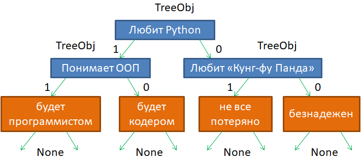

**Большой подвиг 8.** Требуется реализовать программу по работе с решающими деревьями:

Здесь в каждом узле дерева делается проверка (задается вопрос).
Если проверка проходит, то осуществляется переход к следующему объекту по левой стрелке (с единицей), а иначе - по 
правой стрелке (с нулем). И так до тех пор, пока не дойдем до одного из листа дерева (вершины без потомков).

В качестве входных данных используется вектор (список) с бинарными значениями: 1 - да, 0 - нет.
Каждый элемент этого списка соответствует своему вопросу (своей вершине дерева), например:

 

Далее, этот вектор применяется к решающему дереву, следующим образом. Корневая вершина "Любит Python" с ней связан
первый элемент вектора x и содержит значение 1, следовательно, мы переходим по левой ветви. Попадаем в вершину 
"Понимает ООП". С ней связан второй элемент вектора x со значением 0, следовательно, мы переходим по правой ветви
и попадаем в вершину "будет кодером". Так как эта вершина конечная (листовая), то получаем результат в виде строки
"будет кодером". По аналогии выполняется обработка вектора x с другими наборами значений 0 и 1.

Для реализации решающих деревьев в программе следует объявить два класса:

`TreeObj` - для описания вершин и листьев решающего дерева; \
`DecisionTree` - для работы с решающим деревом в целом.

В классе DecisionTree должны быть реализованы (по крайне мере) два метода уровня класса (@classmethod):

`def predict(cls, root, x)` - для построения прогноза (прохода по решающему дереву) для вектора x из корневого узла 
дерева root (возвращает значение узла - атрибут value). \
`def add_obj(cls, obj, node=None, left=True)` - для добавления вершин в решающее дерево (метод должен возвращать 
добавленную вершину - объект класса TreeObj);

В методе add_obj параметры имеют, следующие значения:

`obj` - ссылка на новый (добавляемый) объект решающего дерева (объект класса TreeObj); \
`node` - ссылка на объект дерева, к которому присоединяется вершина obj; \
`left` - флаг, определяющий ветвь дерева (объекта node), к которой присоединяется объект obj  
(True - к левой ветви; False - к правой).

В классе TreeObj следует объявить инициализатор:

`def __init__(self, indx, value=None):` ...

где \
`indx` - проверяемый в вершине дерева индекс вектора x; \
`value` - значение, хранящееся в вершине (принимает значение None для вершин, у которых есть потомки - промежуточных вершин).

При этом, в каждом создаваемом объекте класса TreeObj должны автоматически появляться следующие локальные атрибуты:

`indx` - проверяемый индекс (целое число); \
`value` - значение с данными (строка); \
`__left` - ссылка на следующий объект дерева по левой ветви (изначально None); \
`__right` - ссылка на следующий объект дерева по правой ветви (изначально None).

Для работы с локальными приватными атрибутами __left и __right необходимо объявить объекты-свойства с именами left и right.

Эти классы в дальнейшем предполагается использовать следующим образом (эти строчки в программе не писать):

- `root = DecisionTree.add_obj(TreeObj(0))`
- `v_11 = DecisionTree.add_obj(TreeObj(1), root)`
- `v_12 = DecisionTree.add_obj(TreeObj(2), root, False)`
- `DecisionTree.add_obj(TreeObj(-1, "будет программистом"), v_11)`
- `DecisionTree.add_obj(TreeObj(-1, "будет кодером"), v_11, False)`
- `DecisionTree.add_obj(TreeObj(-1, "не все потеряно"), v_12)`
- `DecisionTree.add_obj(TreeObj(-1, "безнадежен"), v_12, False)`

- `x = [1, 1, 0]`
- `res = DecisionTree.predict(root, x) # будет программистом`

P.S. В программе требуется объявить только классы. На экран ничего выводить не нужно. 