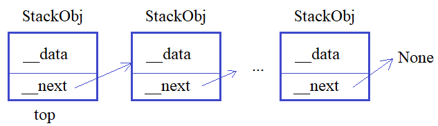

**Подвиг 6.** Ранее вы уже создавали стек-подобную структуру, когда один объект ссылается на следующий и так по цепочке до последнего:



Для этого в программе объявлялись два класса: 

`StackObj` - для описания объектов стека; \
`Stack` - для управления стек-подобной структурой.

И, далее, объекты класса `StackObj` следовало создавать командой:

`obj = StackObj(data)` \
где `data` - это строка с некоторым содержимым объекта (данными).
При этом каждый объект класса `StackObj` должен иметь следующие локальные атрибуты:

`data` - ссылка на строку с данными, указанными при создании объекта; \
`next` - ссылка на следующий объект класса `StackObj` (при создании объекта принимает значение `None`).

Класс `Stack` предполагается использовать следующим образом:

`st = Stack() # создание объекта стек-подобной структуры` \
В каждом объекте класса `Stack` должен быть локальный публичный атрибут:

`top` - ссылка на первый объект стека (если стек пуст, то `top = None`).

А в самом классе `Stack` следующие методы:

`push(self, obj)` - добавление объекта класса `StackObj` в конец стека;
`pop(self)` - извлечение последнего объекта с его удалением из стека;

Дополнительно в классе `Stack` нужно объявить магические методы для обращения к объекту стека по его индексу, например:

```python
obj_top = st[0] # получение первого объекта
obj = st[4] # получение 5-го объекта стека
st[2] = StackObj("obj3") # замена прежнего (3-го) объекта стека на новый
```

Если индекс не целое число или число меньше нуля или больше числа объектов в стеке, то должно генерироваться исключение командой:

`raise IndexError('неверный индекс')` \
Пример использования классов `Stack` и `StackObj` (эти строчки в программе не писать):

```python
st = Stack()
st.push(StackObj("obj1"))
st.push(StackObj("obj2"))
st.push(StackObj("obj3"))
st[1] = StackObj("new obj2")
print(st[2].data) # obj3
print(st[1].data) # new obj2
res = st[3] # исключение IndexError
```

P.S. В программе нужно объявить только классы. Выводить на экран ничего не нужно.