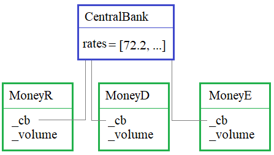

**Подвиг 8.** В программе необходимо объявить классы для работы с кошельками в разных валютах:

`MoneyR` - для рублевых кошельков \
`MoneyD` - для долларовых кошельков \
`MoneyE` - для евро-кошельков



Объекты этих классов могут создаваться командами:

`rub = MoneyR()`   # с нулевым балансом \
`dl = MoneyD(1501.25)` # с балансом в 1501.25 долларов \
`euro = MoneyE(100)`  # с балансом в 100 евро

В каждом объекте этих классов должны формироваться локальные атрибуты:

`__cb` - ссылка на класс `CentralBank` (центральный банк, изначально `None`); \
`__volume` - объем денежных средств в кошельке (если не указано, то 0).

Также в классах `MoneyR`, `MoneyD` и `MoneyE` должны быть объекты-свойства (property) для работы с локальными атрибутами:

`cb` - для изменения и считывания данных из переменной `__cb`; \
`volume` - для изменения и считывания данных из переменной `__volume`.

Объекты классов должны поддерживать следующие операторы сравнения:

```python
rub < dl
dl >= euro
rub == euro  # значения сравниваются по текущему курсу центрального банка с погрешностью 0.1 (плюс-минус)
euro > rub
```

При реализации операторов сравнения считываются соответствующие значения `__volume` из сравниваемых объектов и 
приводятся к рублевому эквиваленту в соответствии с курсом валют центрального банка.

Чтобы каждый объект классов `MoneyR`, `MoneyD` и `MoneyE` "знал" текущие котировки, необходимо в программе объявить еще
один класс `CentralBank`. Объекты класса `CentralBank` создаваться не должны (запретить), при выполнении команды:

`cb = CentralBank()`

должно просто возвращаться значение `None`. А в самом классе должен присутствовать атрибут:

`rates = {'rub': 72.5, 'dollar': 1.0, 'euro': 1.15}` \
Здесь числа (в значениях словаря) - курс валюты по отношению к доллару. 

Также в `CentralBank` должен быть метод уровня класса:

`register(cls, money)` - для регистрации объектов классов `MoneyR`, `MoneyD` и `MoneyE`.

При регистрации значение `__cb` объекта money должно ссылаться на класс `CentralBank`.
Через эту переменную объект имеет возможность обращаться к атрибуту rates класса `CentralBank` и брать нужные котировки.

Если кошелек не зарегистрирован, то при операциях сравнения должно генерироваться исключение:

`raise ValueError("Неизвестен курс валют.")`

Пример использования классов (эти строчки в программе писать не нужно):

```python
CentralBank.rates = {'rub': 72.5, 'dollar': 1.0, 'euro': 1.15}

r = MoneyR(45000)
d = MoneyD(500)

CentralBank.register(r)
CentralBank.register(d)

if r > d:
    print("неплохо")
else:
    print("нужно поднажать")
```

P.S. В программе на экран ничего выводить не нужно, только объявить классы.