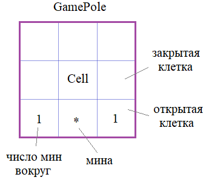

**Большой подвиг 8.** Вы начинаете разрабатывать игру "Сапер". Для этого вам нужно уметь представлять и управлять 
игровым полем. Будем полагать, что оно имеет размеры N x M клеток.
Каждая клетка будет представлена объектом класса `Cell` и содержать либо число мин вокруг этой клетки, либо саму мину.



Для начала в программе объявите класс `GamePole`, который будет создавать и управлять игровым полем.
Объект этого класса должен формироваться командой:

`pole = GamePole(N, M, total_mines)` \
И, так как поле в игре одно, то нужно контролировать создание только одного объекта класса `GamePole` (используйте 
паттерн `Singleton`, о котором мы с вами говорили, когда рассматривали магический метод `__new__()`).

Объект `pole` должен иметь локальный приватный атрибут:

`__pole_cells` - двумерный (вложенный) кортеж, размерами N x M элементов (N строк и M столбцов), состоящий из объектов класса `Cell`.

Для доступа к этой коллекции объявите в классе `GamePole` объект-свойство (`property`):

`pole` - только для чтения (получения) ссылки на коллекцию `__pole_cells`.

Далее, в самом классе `GamePole` объявите следующие методы:

`init_pole()` - для инициализации начального состояния игрового поля (расставляет мины и делает все клетки закрытыми); \
`open_cell(i, j)` - открывает ячейку с индексами (i, j); нумерация индексов начинается с нуля; метод меняет значение атрибута `__is_open` объекта `Cell` в ячейке `(i, j)` на `True`; \
`show_pole()` - отображает игровое поле в консоли (как именно сделать - на ваше усмотрение, этот метод - домашнее задание).

Расстановку мин выполняйте случайным образом по игровому полю (для этого удобно воспользоваться функцией `randint` модуля `random`).
После расстановки всех `total_mines` мин, вычислите их количество вокруг остальных клеток (где нет мин). Область охвата - соседние (прилегающие) клетки (8 штук).

В методе `open_cell()` необходимо проверять корректность индексов (i, j). Если индексы указаны некорректно, то генерируется исключение командой:

`raise IndexError('некорректные индексы i, j клетки игрового поля')` \
Следующий класс Cell описывает состояние одной ячейки игрового поля. Объекты этого класса создаются командой:

`cell = Cell()` \
При этом в самом объекте создаются следующие локальные приватные свойства:

`__is_mine` - булево значение `True/False`; `True` - в клетке находится мина, `False` - мина отсутствует;
`__number` - число мин вокруг клетки (целое число от 0 до 8);
`__is_open` - флаг того, открыта клетка или закрыта: `True` - открыта; `False` - закрыта.

Для работы с этими приватными атрибутами объявите в классе `Cell` следующие объекты-свойства с именами:

`is_mine` - для записи и чтения информации из атрибута `__is_mine`;
`number` - для записи и чтения информации из атрибута `__number`;
`is_open` - для записи и чтения информации из атрибута `__is_open`.

В этих свойствах необходимо выполнять проверку на корректность переданных значений (либо булево значение True/False,
либо целое число от 0 до 8). Если передаваемое значение некорректно, то генерировать исключение командой:

`raise ValueError("недопустимое значение атрибута")` \
С объектами класса `Cell` должна работать функция:

`bool(cell)` \
которая возвращает `True`, если клетка закрыта и `False` - если открыта.

Пример использования классов (эти строчки в программе писать не нужно):

```python
pole = GamePole(10, 20, 10)  # создается поле размерами 10x20 с общим числом мин 10
pole.init_pole()
if pole.pole[0][1]:
    pole.open_cell(0, 1)
if pole.pole[3][5]:
    pole.open_cell(3, 5)
pole.open_cell(30, 100)  # генерируется исключение IndexError
pole.show_pole()
```

P.S. В программе на экран выводить ничего не нужно, только объявить классы.