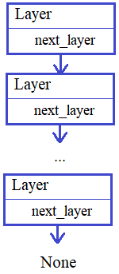
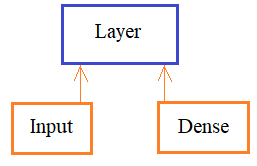

**Большой подвиг 9.** Используя механизм наследования, вам поручено разработать функционал по построению моделей
нейронных сетей. Общая схема модели очень простая:



Базовый класс `Layer` имеет локальный атрибут `next_layer`, который ссылается на следующий объект слоя нейронной сети
(объект класса `Layer` или любого объекта дочерних классов). У последнего слоя значение `next_layer = None`.

Создавать последовательность слоев предполагается командами:

```
first_layer = Layer()
next_layer = first_layer(Layer())
next_layer = next_layer(Layer())
...
```

То есть, сначала создается объект `first_layer` класса `Layer`, а затем он вызывается как функция для образования связки
со следующим слоем. При этом возвращается ссылка на следующий слой и переменная `next_layer` ссылается уже на этот 
следующий слой нейронной сети. И так можно создавать столько слоев, сколько необходимо.

В каждом объекте класса `Layer` также должен формироваться локальный атрибут:

`name = 'Layer'`

Но сам по себе класс `Layer` образует только связи между слоями.
Никакой другой функциональности он не несет. Чтобы это исправить, в программе нужно объявить еще два дочерних класса:

`Input` - формирование входного слоя нейронной сети; \
`Dense` - формирование полносвязного слоя нейронной сети.



Конечно, создавать нейронную сеть мы не будем. Поэтому, в классе `Input` нужно лишь прописать инициализатор так, чтобы 
его объекты создавались следующим образом:

`inp = Input(inputs)` \
где `inputs` - общее число входов (целое число). Также в объектах класса `Input` должен автоматически формироваться атрибут:

`name = 'Input'`

(Не забывайте при этом, вызывать инициализатор базового класса `Layer`).

Объекты второго дочернего класса `Dense` предполагается создавать командой:

`dense = Dense(inputs, outputs, activation)` \
где `inputs` - число входов в слой; \
`outputs` - число выходов слоя (целые числа); \
`activation` - функция активации (строка, например: 'linear', 'relu', 'sigmoid').

И в каждом объекте класса `Dense` также должен автоматически формироваться атрибут:

`name = 'Dense'`

Все эти классы совместно можно использовать следующим образом (эти строчки пример, писать не нужно):

```python
network = Input(128)
layer = network(Dense(network.inputs, 1024, 'linear'))
layer = layer(Dense(layer.inputs, 10, 'softmax'))
```

Здесь создается три слоя нейронной сети. 

Наконец, для перебора всех слоев с помощью цикла `for`, необходимо объявить отдельный класс `NetworkIterator` для 
итерирования (перебора) слоев нейронной сети следующим образом:

```python
for x in NetworkIterator(network):
    print(x.name)
```

Здесь создается объект класса `NetworkIterator`. На вход передается первый объект (слой) нейронной сети.
Объект этого класса является итератором, который в цикле for последовательно возвращает объекты (слои) нейронной сети.

P.S. В программе нужно объявить только классы. Выводить на экран ничего не нужно.