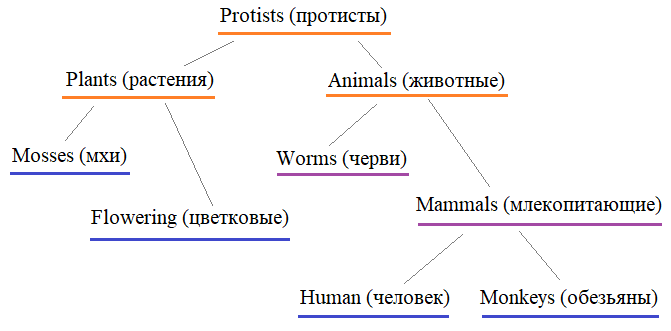

**Подвиг 5.** Объявите в программе следующие классы без содержимого (используйте оператор pass):

`Protists`, `Plants`, `Animals`, `Mosses`, `Flowering`, `Worms`, `Mammals`, `Human`, `Monkeys`

и постройте схему наследования в соответствии со следующей иерархией древа жизни:



Затем, объявите в программе классы:

`Monkey` - наследуется от `Monkeys` и служит для описания обезьян; \
`Person` - наследуется от `Human` и служит для описания человека; \
`Flower` - наследуется от `Flowering` и служит для описания цветка; \
`Worm` - наследуется от `Worms` и служит для описания червей.

Объекты этих классов должны создаваться командами:

```python
obj = Monkey(name, weight, old)
obj = Person(name, weight, old)
obj = Flower(name, weight, old)
obj = Worm(name, weight, old)
```

где `name` - наименование (или имя) объекта (строка); \
`weight` - вес (вещественное число); \
`old` - возраст (целое число).

В каждом объекте любого из этих классов должны создаваться соответствующие атрибуты: `name`, `weight`, `old`.

Создайте в программе следующие объекты и сохраните их в виде списка `lst_objs`:

```
Monkey: "мартышка", 30.4, 7
Monkey: "шимпанзе", 24.6, 8
Person: "Балакирев", 88, 34
Person: "Верховный жрец", 67.5, 45
Flower: "Тюльпан", 0.2, 1
Flower: "Роза", 0.1, 2
Worm: "червь", 0.01, 1
Worm: "червь 2", 0.02, 1
```

Затем, используя функции `isinstance()` и генератор списков (`List comprehensions`), сформируйте следующие списки из указанных объектов:

`lst_animals` - все объекты, относящиеся к животным (Animals); \
`lst_plants` - все объекты, относящиеся к растениям (Plants); \
`lst_mammals` - все объекты, относящиеся к млекопитающим (Mammals).

P.S. В программе на экран выводить ничего не нужно.