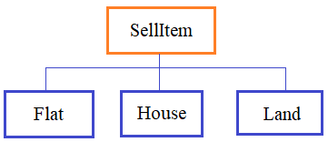

**Подвиг 5.** Вам поручено организовать представление объектов для продажи в риэлтерских агентствах. 
Для этого в программе нужно объявить базовый класс `SellItem`, объекты которого создаются командой:

`item = SellItem(name, price)` \
где `name` - название объекта продажи (строка); \
`price` - цена продажи (число: целое или вещественное).

Каждые конкретные типы объектов описываются следующими классами, унаследованные от базового `SellItem`:

`House` - дома; \
`Flat` - квартиры; \
`Land` - земельные участки.



Объекты этих классов создаются командами:

```python
house = House(name, price, material, square)
flat = Flat(name, price, size, rooms)
land = Land(name, price, square)
```

В каждом объекте этих классов должны формироваться соответствующие локальные атрибуты: `name`, `price` и т.д.

Формирование атрибутов name и `price` должно выполняться в инициализаторе базового класса.

Далее, объявить еще один класс с именем `Agency`, объекты которого создаются командой:

`ag = Agency(name)` \
где `name` - название агентства (строка).

В классе `Agency` объявить следующие методы:

`add_object(obj)` - добавление нового объекта недвижимости для продажи (один из объектов классов: `House`, `Flat`, `Land`); \
`remove_object(obj)` - удаление объекта `obj` из списка объектов для продажи; \
`get_objects()` - возвращает список из всех объектов для продажи.

Пример использования классов (эти строчки в программе не писать):

```python
ag = Agency("Рога и копыта")
ag.add_object(Flat("квартира, 3к", 10000000, 121.5, 3))
ag.add_object(Flat("квартира, 2к", 8000000, 74.5, 2))
ag.add_object(Flat("квартира, 1к", 4000000, 54, 1))
ag.add_object(House("дом, крипичный", price=35000000, material="кирпич", square=186.5))
ag.add_object(Land("участок под застройку", 3000000, 6.74))
for obj in ag.get_objects():
    print(obj.name)

lst_houses = [x for x in ag.get_objects() if isinstance(x, House)] # выделение списка домов
```

P.S. В программе нужно объявить только классы. На экран выводить ничего не нужно.