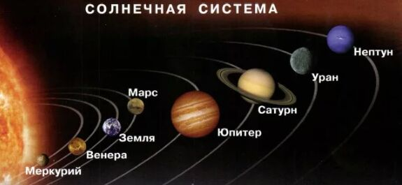

**Подвиг 5.** Объявите класс `Planet` (планета), объекты которого создаются командой:

`p = Planet(name, diametr, period_solar, period)` \
где `name` - наименование планеты; \
`diametr` - диаметр планеты (любое положительное число); \
`period_solar` - период (время) обращения планеты вокруг Солнца (любое положительное число); \
`period` - период обращения планеты вокруг своей оси (любое положительное число).

В каждом объекте класса `Planet` должны формироваться локальные атрибуты с именами:
`_name`, `_diametr`, `_period_solar`, `_period` и соответствующими значениями.

Затем, объявите класс с именем `SolarSystem` (солнечная система).
В объектах этого класса должны быть допустимы, следующие локальные атрибуты 
(ограничение задается через коллекцию `__slots__`):

`_mercury` - ссылка на планету Меркурий (объект класса `Planet`); \
`_venus` - ссылка на планету Венера (объект класса `Planet`); \
`_earth` - ссылка на планету Земля (объект класса `Planet`); \
`_mars` - ссылка на планету Марс (объект класса `Planet`); \
`_jupiter` - ссылка на планету Юпитер (объект класса `Planet`); \
`_saturn` - ссылка на планету Сатурн (объект класса `Planet`); \
`_uranus` - ссылка на планету Уран (объект класса `Planet`); \
`_neptune` - ссылка на планету Нептун (объект класса `Planet`). 

Объект класса `SolarSystem` должен создаваться командой:

`s_system = SolarSystem()` \
и быть только один (одновременно в программе два и более объектов класса `SolarSystem` недопустимо).
Используйте для этого паттерн `Singleton`.

В момент создания объекта `SolarSystem` должны автоматически создаваться перечисленные локальные атрибуты и ссылаться 
на соответствующие объекты класса `Planet` со следующими данными по планетам:

Создайте в программе объект `s_system` класса `SolarSystem`.

P.S. В программе следует объявить только классы и создать объект `s_system`. На экран выводить ничего не нужно.