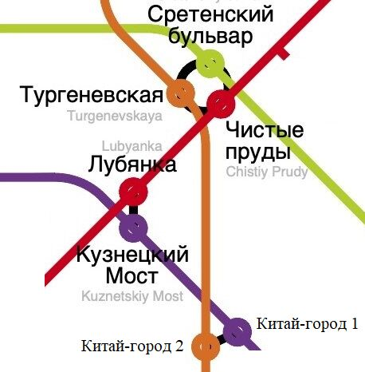
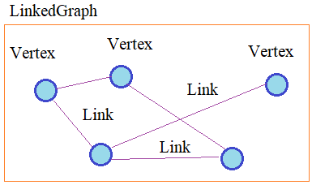

# Испытание "Бремя наследия"

Всевидящее око начальства увидело, что вы прошли еще одну ступень в постижении глубин ООП языка Python - наследование.
Вас вновь решили испытать и посмотреть, на что вы действительно способны. Тимлид (Teamleader) с широкой улыбкой
протянул вам следующее задание.

### Техническое задание

Необходимо написать универсальную основу для представления ненаправленных связных графов и поиска в них кратчайших 
маршрутов. Далее, этот алгоритм предполагается применять для прокладки маршрутов: на картах, в метро и так далее.



Для универсального описания графов, вам требуется объявить в программе следующие классы:

*Vertex* - для представления вершин графа (на карте это могут быть: здания, остановки, достопримечательности и т.п.); \
*Link* - для описания связи между двумя произвольными вершинами графа (на карте: маршруты, время в пути и т.п.); \
*LinkedGraph* - для представления связного графа в целом (карта целиком).



Объекты класса Vertex должны создаваться командой:

`v = Vertex()`

и содержать локальный атрибут:

`_links` - список связей с другими вершинами графа (список объектов класса Link).

Также в этом классе должно быть объект-свойство (property):

`links` - для получения ссылки на список `_links`.

Объекты следующего класса `Link` должны создаваться командой:

`link = Link(v1, v2)` \
где `v1`, `v2` - объекты класса `Vertex` (вершины графа).
Внутри каждого объекта класса `Link` должны формироваться следующие локальные атрибуты:

`_v1`, `_v2` - ссылки на объекты класса `Vertex`, которые соединяются данной связью; \
`_dist` - длина связи (по умолчанию 1); это может быть длина пути, время в пути и др.

В классе `Link` должны быть объявлены следующие объекты-свойства:

`v1` - для получения ссылки на вершину `v1`;
`v2` - для получения ссылки на вершину `v2`;
`dist` - для изменения и считывания значения атрибута `_dist`.

Наконец, объекты третьего класса `LinkedGraph` должны создаваться командой:

`map_graph = LinkedGraph()` \
В каждом объекте класса `LinkedGraph` должны формироваться локальные атрибуты:

`_links` - список из всех связей графа (из объектов класса Link); \
`_vertex` - список из всех вершин графа (из объектов класса Vertex).

В самом классе `LinkedGraph` необходимо объявить (как минимум) следующие методы:

`def add_vertex(self, v):` ... - для добавления новой вершины v в список `_vertex` (если она там отсутствует); \
`def add_link(self, link):` ... - для добавления новой связи link в список `_links` (если объект link с указанными 
вершинами в списке отсутствует); \
`def find_path(self, start_v, stop_v):` ... - для поиска кратчайшего маршрута из вершины `start_v` в вершину `stop_v`.

Метод `find_path()` должен возвращать список из вершин кратчайшего маршрута и список из связей этого же маршрута в виде кортежа: 

`([вершины кратчайшего пути], [связи между вершинами])`

Поиск кратчайшего маршрута допустимо делать полным перебором с помощью рекурсивной функции (будем полагать,
что общее число вершин в графе не превышает 100). Для тех, кто желает испытать себя в полной мере, можно реализовать 
алгоритм Дейкстры поиска кратчайшего пути в связном взвешенном графе.

В методе `add_link()` при добавлении новой связи следует автоматически добавлять вершины этой связи в список `_vertex`,
если они там отсутствуют.

Проверку наличия связи в списке `_links` следует определять по вершинам этой связи.
Например, если в списке имеется объект:

`_links = [Link(v1, v2)]`

то добавлять в него новые объекты `Link(v2, v1)` или `Link(v1, v2)` нельзя (обратите внимание у всех трех объектов будут 
разные id, т.е. по id определять вхождение в список нельзя).

Подсказка: проверку на наличие существующей связи можно выполнить с использованием функции `filter()` и указанием
нужного условия для отбора объектов.

Пример использования классов, применительно к схеме метро (эти строчки в программе писать не нужно):

```python
map_graph = LinkedGraph()

v1 = Vertex()
v2 = Vertex()
v3 = Vertex()
v4 = Vertex()
v5 = Vertex()
v6 = Vertex()
v7 = Vertex()

map_graph.add_link(Link(v1, v2))
map_graph.add_link(Link(v2, v3))
map_graph.add_link(Link(v1, v3))

map_graph.add_link(Link(v4, v5))
map_graph.add_link(Link(v6, v7))

map_graph.add_link(Link(v2, v7))
map_graph.add_link(Link(v3, v4))
map_graph.add_link(Link(v5, v6))

print(len(map_graph._links))   # 8 связей
print(len(map_graph._vertex))  # 7 вершин
path = map_graph.find_path(v1, v6)
```

Однако, в таком виде применять классы для схемы карты метро не очень удобно. Например, здесь нет указаний названий 
станций, а также длина каждого сегмента равна 1, что не соответствует действительности.

Чтобы поправить этот момент и реализовать программу поиска кратчайшего пути в метро между двумя произвольными станциями,
объявите еще два дочерних класса:

`class Station(Vertex):` ... - для описания станций метро; \
`class LinkMetro(Link):` ... - для описания связей между станциями метро.

Объекты класса Station должны создаваться командой:

`st = Station(name)` \
где `name` - название станции (строка). В каждом объекте класса `Station` должен дополнительно формироваться 
локальный атрибут:

`name` - название станции метро.

(Не забудьте в инициализаторе дочернего класса вызывать инициализатор базового класса).

В самом классе `Station` переопределите магические методы `__str__()` и `__repr__()`, чтобы они возвращали название
станции метро (локальный атрибут name).

Объекты второго класса `LinkMetro` должны создаваться командой:

`link = LinkMetro(v1, v2, dist)` \
где `v1`, `v2` - вершины (станции метро);
`dist` - расстояние между станциями (любое положительное число).

(Также не забывайте в инициализаторе этого дочернего класса вызывать инициализатор базового класса).

В результате, эти классы должны совместно работать следующим образом (эти строчки в программе писать не нужно):

```python
map_metro = LinkedGraph()
v1 = Station("Сретенский бульвар")
v2 = Station("Тургеневская")
v3 = Station("Чистые пруды")
v4 = Station("Лубянка")
v5 = Station("Кузнецкий мост")
v6 = Station("Китай-город 1")
v7 = Station("Китай-город 2")

map_metro.add_link(LinkMetro(v1, v2, 1))
map_metro.add_link(LinkMetro(v2, v3, 1))
map_metro.add_link(LinkMetro(v1, v3, 1))

map_metro.add_link(LinkMetro(v4, v5, 1))
map_metro.add_link(LinkMetro(v6, v7, 1))

map_metro.add_link(LinkMetro(v2, v7, 5))
map_metro.add_link(LinkMetro(v3, v4, 3))
map_metro.add_link(LinkMetro(v5, v6, 3))

print(len(map_metro._links))
print(len(map_metro._vertex))
path = map_metro.find_path(v1, v6)  # от сретенского бульвара до китай-город 1
print(path[0])    # [Сретенский бульвар, Тургеневская, Китай-город 2, Китай-город 1]
print(sum([x.dist for x in path[1]]))  # 7
```

P.S. В программе нужно объявить только классы Vertex, Link, LinkedGraph, Station, LinkMetro. На экран ничего выводить не нужно.